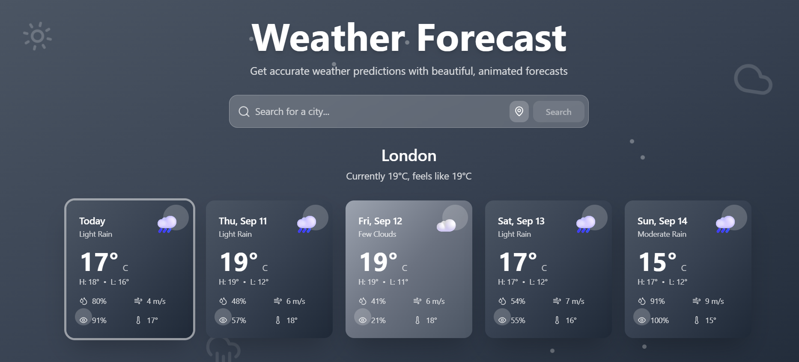
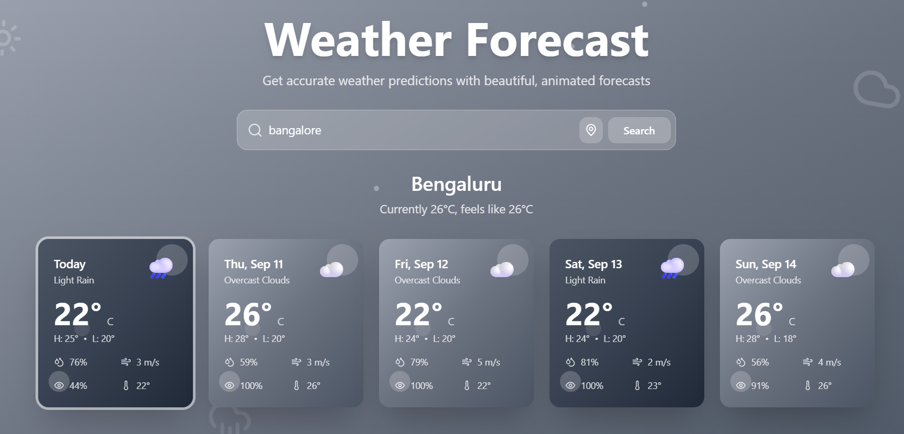

# WeatherForecast
A modern, production-ready weather application that delivers stunning visual experiences with real-time weather data. Built with React, TypeScript, and Tailwind CSS, this project showcases professional web development practices with beautiful design aesthetics.

Project Overview
This weather forecast application provides users with accurate 5-day weather predictions through an intuitive, visually appealing interface. The design philosophy centers around creating an immersive experience where the interface itself reflects the current weather conditions through dynamic backgrounds, adaptive color schemes, and smooth animations.

Key Features
Visual Design: The application features weather-responsive gradients that automatically adjust based on current conditions - bright sky blues for sunny weather, sophisticated greys for rainy days, and cool tones for snow. Floating animated particles and weather icons create depth and movement throughout the interface.
User Experience: Users can search for weather by city name or use their current location with a single click. The interface provides immediate visual feedback through loading animations and smooth transitions between states.
Technical Excellence: Built with modern web technologies including React 18, TypeScript for type safety, and Tailwind CSS for responsive design. The application follows production-ready practices with proper error handling, accessibility features, and optimized performance.
Security & Deployment: The project implements secure API key management using environment variables, ensuring sensitive data never appears in the codebase. Complete deployment instructions are provided for GitHub Pages, Vercel, and Netlify with proper security configurations.

  

  

