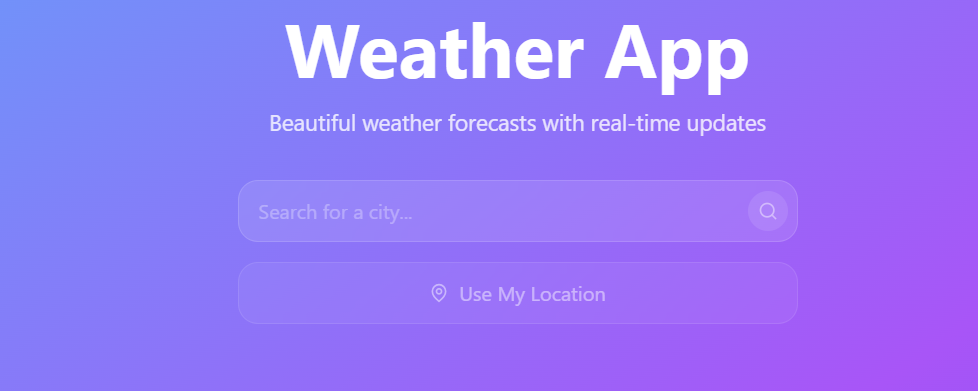
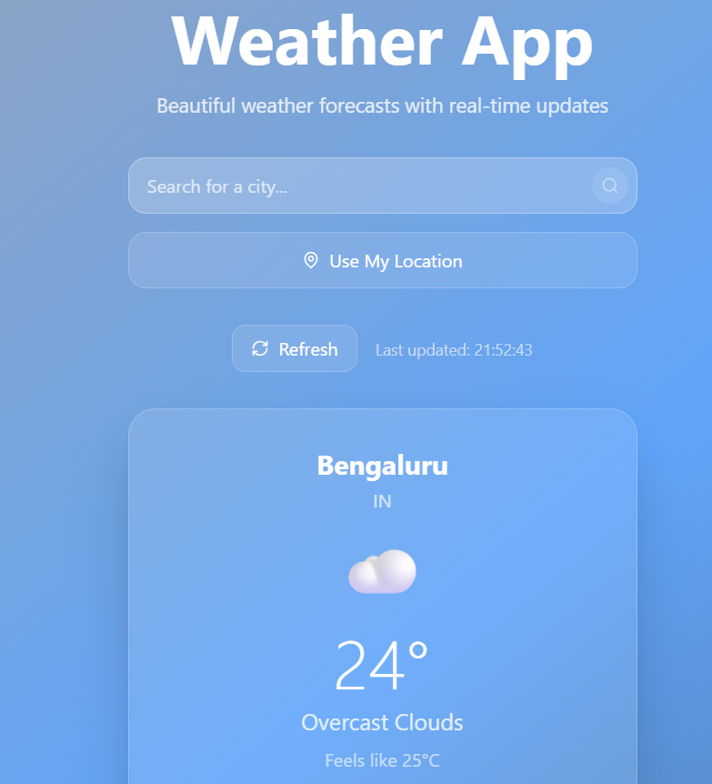
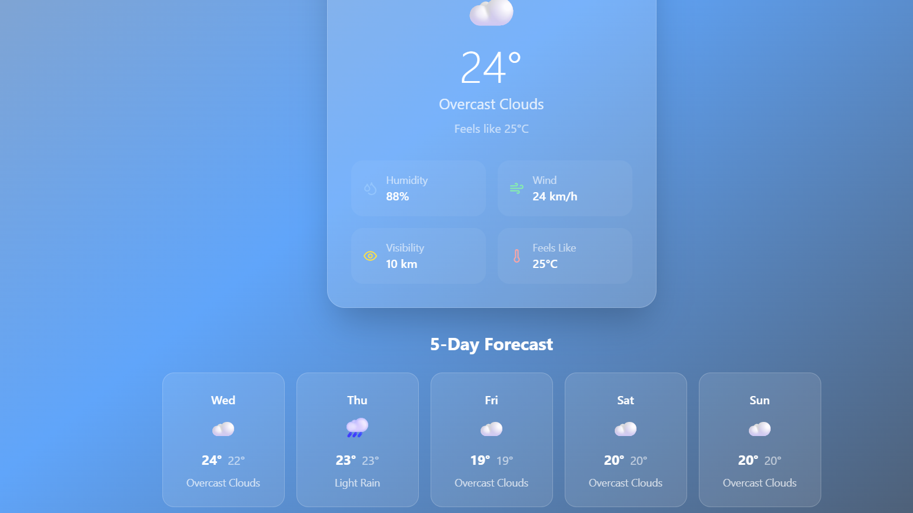

# Weather-Forecast
A simple and interactive web application to view current weather and forecasts for any city. It integrates with public weather APIs to display temperature, humidity, wind speed, and more. The project focuses on responsive design, clean UI, and easy setup, making it ideal for learning API integration and showcasing frontend development skills.

  
  
  

